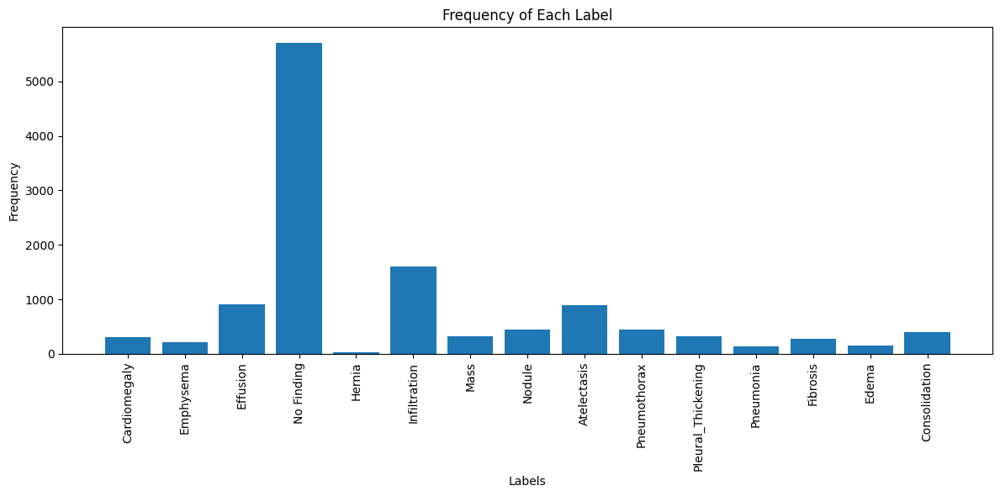
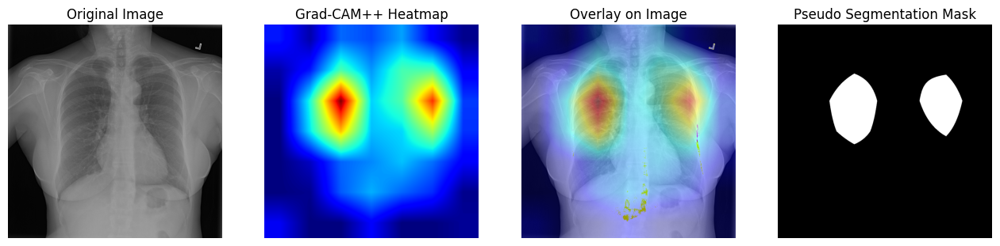

# ChestSight — Multi-Label Pathology Detection from Chest X-Rays

[

> MSc Data Science Thesis Project · University of Salford · 2025  
> **Amit Tiwari** · [LinkedIn](https://linkedin.com/in/amit-tiwari-113920) · [GitHub](https://github.com/iamittiwariji)

---

## Overview

ChestSight is an end-to-end deep learning pipeline for automated detection of **14 thoracic pathologies** from frontal chest X-rays. It fine-tunes a **DenseNet-121** backbone (ImageNet pre-trained) on the NIH ChestX-ray14 benchmark dataset and includes Grad-CAM explainability visualisations for clinical interpretability.

This project replicates and extends the CheXNet architecture (Rajpurkar et al., 2017) and was developed as part of the MSc Data Science thesis at the University of Salford (grade: 75%).

---

## Results (Baseline)

| Metric | Value |
|---|---|
| Micro-avg F1 | 0.49 |
| No Finding F1 | 0.72 (precision 0.59, recall 0.93) |
| Macro-avg F1 | 0.05 |

> The low macro-avg F1 reflects the known class imbalance in NIH ChestX-ray14 (57% "No Finding"). See [Limitations](#limitations) and [Roadmap](#roadmap) for planned improvements.

---

## Tech Stack

| Layer | Technology |
|---|---|
| Deep learning | TensorFlow 2.x / Keras |
| Backbone | DenseNet-121 (ImageNet weights) |
| Data processing | pandas, NumPy |
| Visualisation | Matplotlib, Seaborn |
| Image processing | OpenCV, tf.image |
| Metrics | scikit-learn |
| Explainability | Grad-CAM (GradientTape) |
| Environment | Google Colab (T4 GPU) |

---

## Dataset

This project uses the **NIH ChestX-ray14** dataset.

**You must download the dataset separately before running the notebook.**

1. Download from Kaggle: [https://www.kaggle.com/datasets/nih-chest-xrays/data](https://www.kaggle.com/datasets/nih-chest-xrays/data)
2. Place files in the following structure:

```
data/
  Data_Entry_2017_v2020.csv
  images/
    00000001_000.png
    00000001_001.png
    ...
```

3. Update `DATA_DIR` in Section 1 of the notebook to point to your local `data/` directory.

**Dataset stats:**
- ~112,000 frontal-view chest X-rays
- ~30,805 unique patients
- 14 pathology labels + "No Finding"
- Labels extracted via NLP from radiology reports (multi-label, pipe-delimited)

---

## Project Structure

chestsight-densenet121/
├── ChestSight_Amit_Tiwari.ipynb
├── requirements.txt
├── README.md
├── .gitignore
└── chestsight_results/
    ├── eda/
    ├── training/
    ├── evaluation/
    └── explainability/

---

## Quick Start

### Option 1 — Google Colab (recommended)

1. Open `ChestSight_Amit_Tiwari.ipynb` in Google Colab.
2. Enable GPU: Runtime → Change runtime type → T4 GPU.
3. Upload the dataset to Google Drive and update `DATA_DIR` in Section 1.
4. Run all cells in order.

### Option 2 — Local environment

```bash
git clone https://github.com/iamittiwariji/chestsight-densenet121.git
cd chestsight-densenet121
pip install -r requirements.txt
jupyter notebook ChestSight_Amit_Tiwari.ipynb
```

---

## Notebook Structure

| Section | Description |
|---|---|
| 1. Configuration & Imports | All paths and hyperparameters in one place |
| 2. Data Loading & Label Encoding | CSV parsing, multi-hot encoding |
| 3. Exploratory Data Analysis | Label distribution, demographics, co-occurrence heatmap |
| 4. Data Split & Preprocessing | 70/10/20 split, augmentation pipeline |
| 5. Model Architecture | DenseNet-121 + GAP + Dropout + Sigmoid head |
| 6. Training | Adam, BCE loss, ReduceLROnPlateau, EarlyStopping |
| 7. Evaluation | Classification report, per-class IoU & Dice |
| 8. Grad-CAM Explainability | Heatmaps, overlay, pseudo-segmentation mask |
| 9. Results Summary | Findings and next steps |

---

## Limitations

- **Class imbalance**: BCE loss without class weighting is dominated by the "No Finding" majority class (57.1%).
- **Default threshold**: A global sigmoid threshold of 0.5 suppresses minority class predictions. Per-class threshold optimisation is not yet applied.
- **Label noise**: NIH ChestX-ray14 labels are NLP-mined from reports and carry known noise (~11% error rate in independent audits).
- **Data leakage**: The notebook uses a random 70/10/20 split. Patient-level splitting (to prevent the same patient appearing in train and test) is not yet implemented.

---

## Roadmap

- [ ] Replace BCE with **Focal Loss** for class imbalance
- [ ] **Per-class threshold optimisation** on validation set
- [ ] **Patient-level data splitting** to eliminate leakage
- [ ] **Per-class AUC-ROC** reporting (standard NIH benchmark metric)
- [ ] **Grad-CAM++** for sharper localisation
- [ ] Experiment with **Vision Transformer (ViT)** backbone

## Sample Results




## References

- Wang et al. (2017). *ChestX-ray8: Hospital-Scale Chest X-ray Database and Benchmarks.* CVPR.
- Rajpurkar et al. (2017). *CheXNet: Radiologist-Level Pneumonia Detection on Chest X-Rays with Deep Learning.* arXiv:1711.05225.
- Huang et al. (2017). *Densely Connected Convolutional Networks.* CVPR.
- Selvaraju et al. (2017). *Grad-CAM: Visual Explanations from Deep Networks via Gradient-Based Localization.* ICCV.
- Lin et al. (2017). *Focal Loss for Dense Object Detection.* ICCV.

---

## Licence

This project is released for academic and educational purposes. The NIH ChestX-ray14 dataset is subject to its own [terms of use](https://nihcc.app.box.com/v/ChestXray-NIHCC).